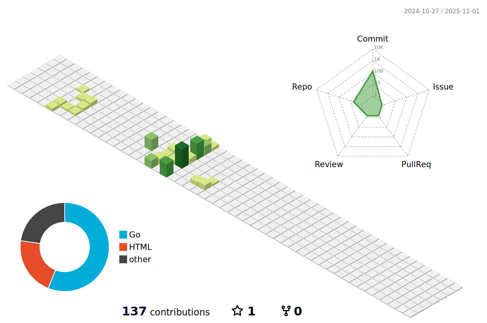

<h2 align="center">Hi ! I'm Dxp </h2>
<h3 align="center">A curious and passionate backend developer from China  </h3>

<h3> Some information about me </h3>

- 🔭 I'm a  backend developer from Anhui, China.
- 🤔 I was previously a civil engineering student, but I love computers and cross-major to teach myself.
- 🌱 I’m currently learning 
  
- 🚀 Motto: 真正的坚持是看清一万次放弃的理由后，仍把『继续』作为第一万零一次呼吸的节奏。
- 📫 How to reach me: Email : dxp20001107@163.com
- 🔥 Fun fact: half marathon
- 💬 ask me about anything, I am happy to help

### Use language 

I want to be a better backend developer, 

    <picture>
      <source media="(prefers-color-scheme: dark)" srcset="https://raw.githubusercontent.com/dwhdxp/dwhdxp/output/github-contribution-grid-snake-dark.svg">
      <source media="(prefers-color-scheme: light)" srcset="https://raw.githubusercontent.com/dwhdxp/dwhdxp/output/github-contribution-grid-snake.svg">
      
    </picture>

<!--
**dwhdxp/dwhdxp** is a ✨ _special_ ✨ repository because its `README.md` (this file) appears on your GitHub profile.

Here are some ideas to get you started:

- 🔭 I’m currently working on ...
- 🌱 I’m currently learning ...
- 👯 I’m looking to collaborate on ...
- 🤔 I’m looking for help with ...
- 💬 Ask me about ...
- 📫 How to reach me: ...
- 😄 Pronouns: ...
- ⚡ Fun fact: ...
-->

[def]: ./profile-3d-contrib/profile-gitblock.svg​